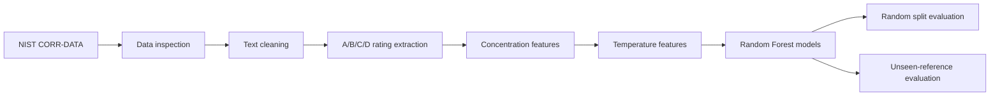
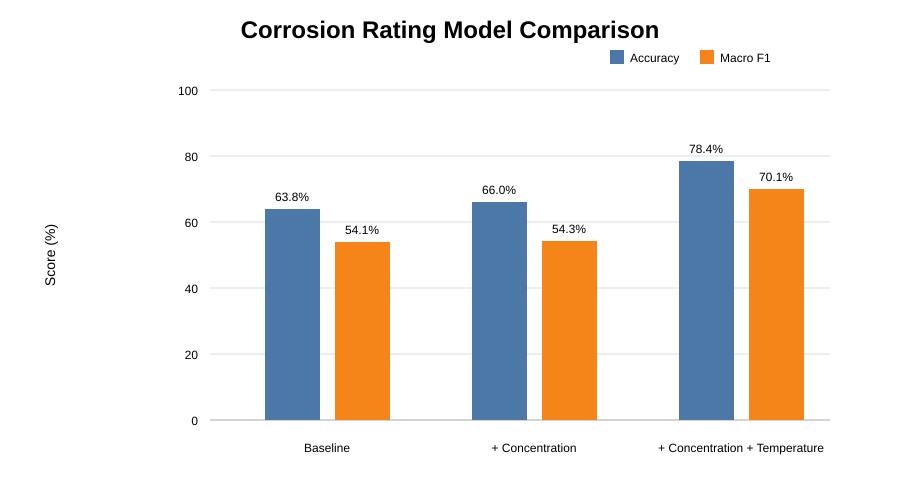
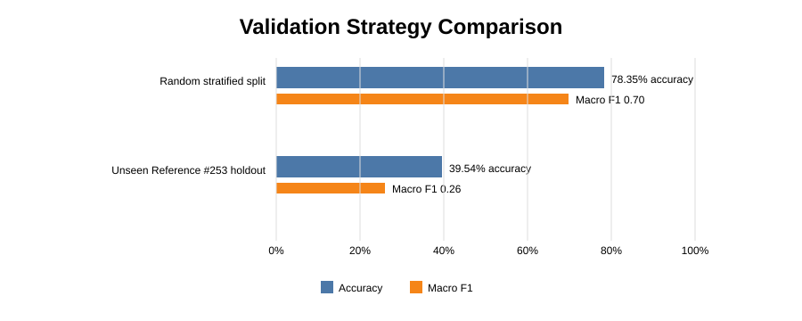
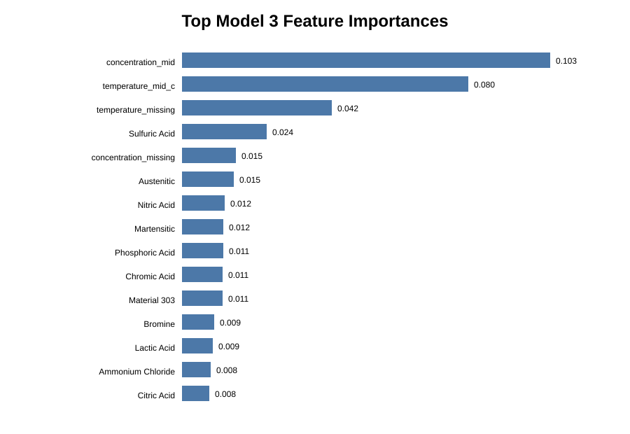

# Corrosion Data Analysis

Machine-learning analysis of the **NIST CORR-DATA** corrosion database using Python, pandas, scikit-learn, and Jupyter.

## Project overview

This project investigates whether corrosion-resistance ratings (**A, B, C, D**) can be classified from material, environment, concentration, and temperature information in the NIST CORR-DATA database.

The emphasis is on a **transparent, reproducible workflow** rather than presenting the model as a production corrosion prediction system.

## Dataset

The analysis uses the NIST CORR-DATA database, containing more than 24,000 corrosion observations from more than 250 source documents.

- [NIST Public Data Repository](https://data.nist.gov/pdr/lps/54AE54FB37AC022DE0531A570681D4291851)
- [Official NIST dataset archive](https://opendata.nist.gov/1851/CORR-DATA_Database.zip)
- [NIST field definitions](https://opendata.nist.gov/od/ds/54AE54FB37AC022DE0531A570681D4291851/CORR-DATA-fields.txt)

The raw CSV is **not committed** to this public repository. Download it from NIST and place it at:

```text
data/CORR-DATA_Database.csv
```

## Workflow



### Data preparation

- Cleaned material, material-family, and environment text fields.
- Extracted clear **A/B/C/D** corrosion ratings.
- Preserved original NIST values while creating safe numerical features.
- Parsed clear numerical temperature and concentration ranges.
- Concentration values above 100 were **not changed**; they were excluded from the numerical Vol-% feature because their meaning could not be safely interpreted as literal volume percent.
- Missing numerical values were filled using **training-set medians**, with missing-value indicators retained.

## Model results

### Random stratified split

| Model | Accuracy | Macro F1 | Weighted F1 |
|---|---:|---:|---:|
| Baseline | 63.84% | 0.541 | 0.658 |
| + Concentration | 66.04% | 0.543 | 0.672 |
| + Concentration + Temperature | **78.35%** | **0.701** | **0.789** |

Adding temperature produced the largest improvement in the random stratified evaluation.



### Validation strategy matters

A random split can place observations from the same source distribution in both training and testing. To examine generalization more strictly, **Reference #253** was held out completely.

| Validation | Training observations | Test observations | Accuracy | Macro F1 |
|---|---:|---:|---:|---:|
| Random stratified split | 13,316 | 3,330 | **78.35%** | **0.701** |
| Unseen Reference #253 | 3,436 | 13,210 | 39.54% | 0.260 |



Reference #253 represents **79.35% of all rated observations**. It also contains a substantially different category composition. In the strict test, **72.61%** of observations had a material category not seen during training and **39.28%** had an unseen environment.

The large performance gap is therefore an important result: the 78.35% random-split score should be interpreted as performance within the observed dataset distribution, **not as guaranteed performance on a previously unseen source**.

## Model interpretation

For the three-feature-set Random Forest, the strongest reported features included:

1. `concentration_mid`
2. `temperature_mid_c`
3. `temperature_missing`
4. specific chemical environment indicators
5. material-family indicators



Feature importance is treated as a **model diagnostic**, not proof of physical causation.

## Confusion-matrix findings

On the random split, the Model 3 confusion matrix showed strong performance for class **A** and substantially better separation of **B/C/D** than the baseline models.

The unseen Reference #253 test was much harder, with many observations from classes A, B, and D being assigned to other classes. This supports the conclusion that source/reference shift is a major challenge for this dataset.

The underlying confusion-matrix outputs are retained in the notebook and can be reproduced from the NIST data.

## Project structure

```text
corrosion-data-analysis/
├── data/
│   └── processed/          # generated outputs are created locally
├── notebooks/
│   └── 01_data_exploration.ipynb
├── results/
│   ├── figures/
│   │   ├── model_comparison.svg
│   │   ├── validation_comparison.svg
│   │   └── feature_importance_top15.svg
│   ├── model_comparison.csv
│   ├── model3_feature_importance_top20.csv
│   ├── validation_comparison.csv
│   └── reference_253_diagnostics.csv
├── src/
├── .gitignore
├── README.md
└── requirements.txt
```

## Reproducibility

1. Install Python 3 and the packages in `requirements.txt`.
2. Download the NIST CORR-DATA CSV from the official source.
3. Place the file at `data/CORR-DATA_Database.csv`.
4. Open `notebooks/01_data_exploration.ipynb`.
5. Run the notebook from top to bottom.

## Limitations

- The database is highly uneven across source references.
- Many concentration and temperature entries are missing or qualitative.
- A random split can give an optimistic estimate when related observations share the same source distribution.
- The Reference #253 holdout is unusually difficult because the training set is much smaller and its material/environment categories differ substantially from the test reference.
- The current Random Forest is a baseline model, not a production corrosion prediction system.

## Status

**Completed:** data cleaning, feature preparation, three-model comparison, feature-importance analysis, and strict reference-based validation.

**Next:** improve validation design and investigate models and features that generalize better across source references.
