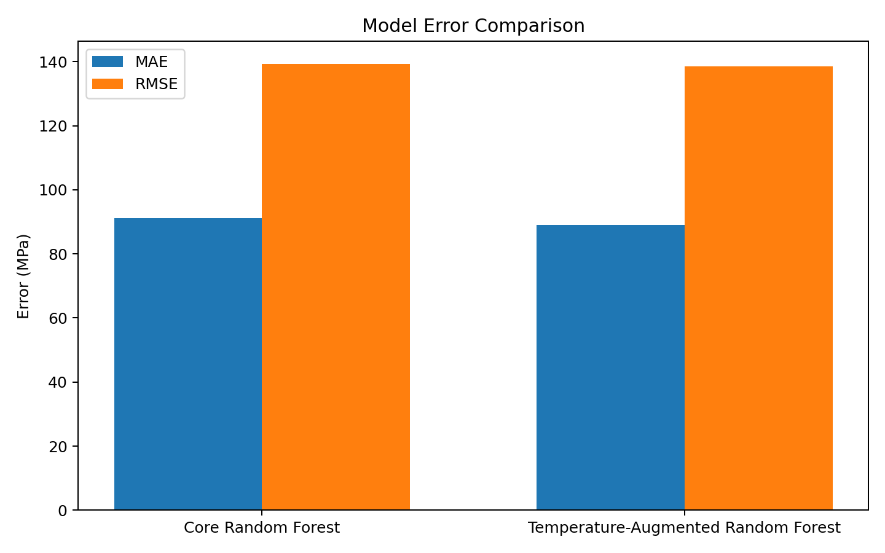
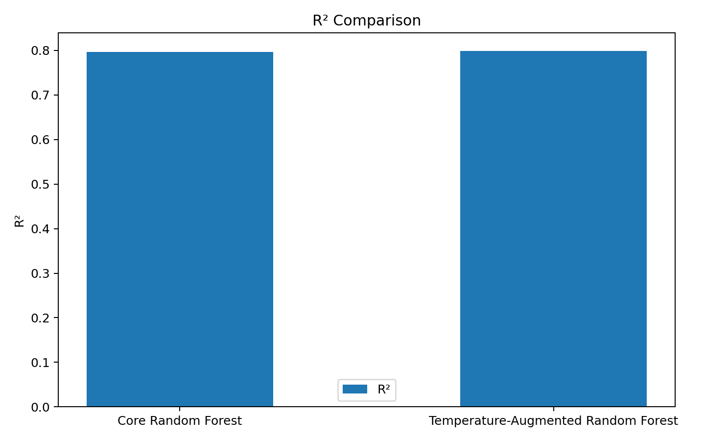
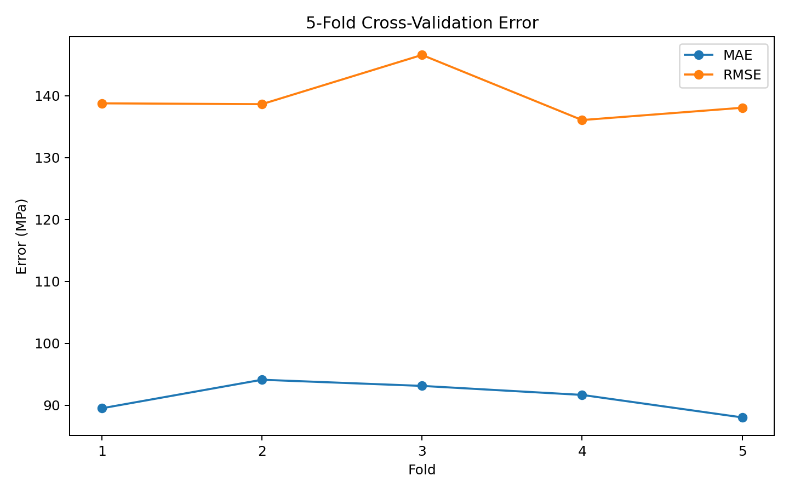
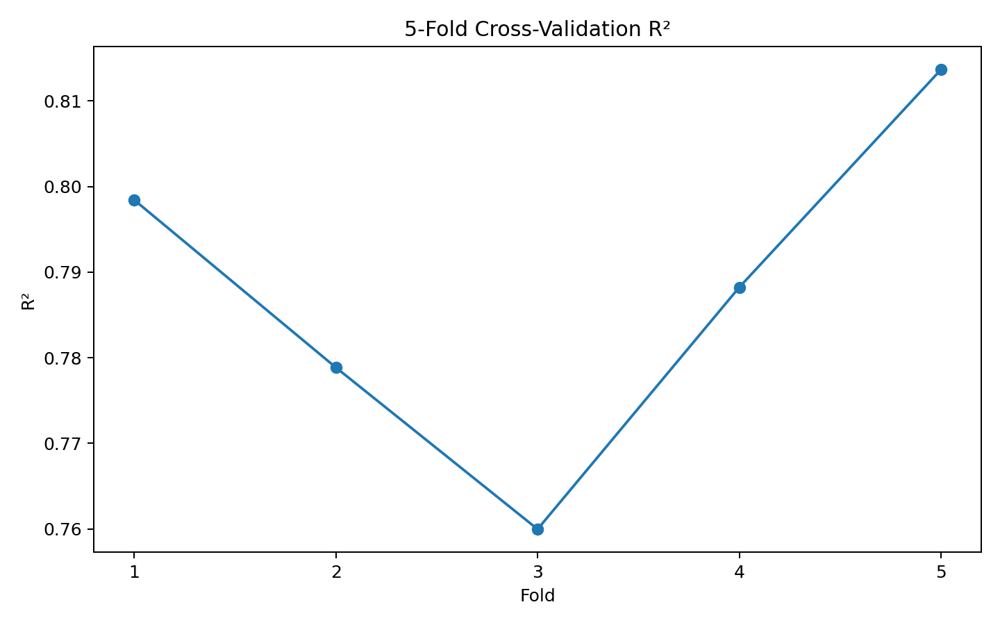

# Machine Learning Prediction of Steel Yield Strength

A materials-focused machine-learning project for predicting steel yield strength from alloy chemistry, processing conditions, heat-treatment states, and validated temperature information.

## Project Status

Core modeling, validation, error analysis, and interpretability workflow completed. A cleaned, end-to-end reproducible notebook is included in `notebooks/`.

## Dataset

- 3,234 raw records
- 1,943 unique records after cleaning and deduplication
- Target: `Yield strength (MPa)`
- Core model: 28 features
- Temperature-augmented model: 32 features
- Reported 20% evaluation split: 1,554 training / 389 testing samples

The raw source spreadsheet is intentionally not committed to the repository.

## Methodology

1. Dataset audit and cleaning
2. Duplicate detection and removal
3. Processing-condition feature engineering
4. Heat-treatment state encoding
5. Quench and temper temperature extraction
6. Temperature missingness indicators and leakage-aware imputation
7. Baseline model comparison
8. Random Forest hyperparameter optimization
9. Leakage-free 5-fold cross-validation
10. Holdout evaluation
11. Residual and strength-range error analysis
12. Random Forest and permutation feature-importance analysis
13. Core vs temperature-augmented comparison

## Final Random Forest Configuration

- `n_estimators = 495`
- `max_depth = 30`
- `max_features = 0.75`
- `min_samples_leaf = 1`
- `min_samples_split = 7`

## Reported Holdout Performance

| Model | MAE (MPa) | RMSE (MPa) | R² |
|---|---:|---:|---:|
| Core Random Forest | 91.24 | 139.37 | 0.7966 |
| Temperature-Augmented Random Forest | **89.03** | **138.46** | **0.7993** |

Temperature augmentation improved the same reported holdout comparison by 2.21 MPa MAE (2.42%), 0.91 MPa RMSE (0.65%), and 0.0026 R² (0.33%).

## Visual Results

The following figures summarize the comparative model evaluation and leakage-free cross-validation results.

### Model Error Comparison



### R² Comparison



### 5-Fold Cross-Validation Error



### 5-Fold Cross-Validation R²



## Leakage-Free 5-Fold Cross-Validation

| Metric | Mean | Std. Dev. |
|---|---:|---:|
| MAE | **91.27 MPa** | 2.25 MPa |
| RMSE | **139.61 MPa** | 3.61 MPa |
| R² | **0.7878** | 0.0181 |

The leakage-free pipeline performs median imputation inside each cross-validation training fold rather than calculating imputation statistics from the full dataset.

## Important Features

The strongest final Random Forest features included:

1. `is_tempered`
2. `Fe`
3. `P`
4. `is_aged`
5. `Mo`
6. `Mn`
7. `C`
8. `is_quenched`
9. `Ni`
10. `Si`

Permutation importance similarly highlighted tempering state, Fe, C, P, quenching state, and aging state.

These are predictive associations, not causal metallurgical conclusions.

## Key Finding

Heat-treatment state and alloy chemistry carry most of the predictive signal in this dataset. Explicit temperature features provide an additional but modest improvement. Prediction error becomes less consistent for sparsely represented high-strength materials, making data coverage an important limitation.

## Validation Note

The original analysis performed hyperparameter search on the full modeling dataset before the reported 20% holdout evaluation. Consequently, the holdout should **not** be described as a completely untouched final test set. The leakage-free 5-fold cross-validation is the primary robustness estimate, while the holdout is best treated as a comparative evaluation.

## Notebook

- `notebooks/reproducible_yield_strength_prediction.ipynb` — cleaned end-to-end workflow
- `notebooks/final_results.ipynb` — compact results-focused notebook

## Repository Structure

```text
yield-strength-prediction/
├── README.md
├── requirements.txt
├── notebooks/
│   ├── reproducible_yield_strength_prediction.ipynb
│   └── final_results.ipynb
├── data/
│   └── README.md
└── results/
    ├── README.md
    ├── model_error_comparison.png
    ├── r2_comparison.png
    ├── cv_error_by_fold.png
    └── cv_r2_by_fold.png
```

## Technologies

Python · pandas · NumPy · scikit-learn · Matplotlib · Jupyter Notebook

## Disclaimer

For educational, analytical, and research purposes. Predictions should not replace experimental testing, engineering standards, or qualified materials-engineering judgment.
